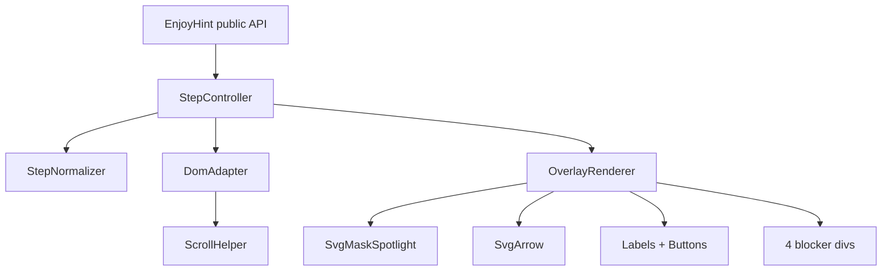

# EnjoyHint TypeScript Rewrite — Design Spec

**Date:** 2026-06-14  
**Status:** Approved  
**Version target:** v5.0.0

## Summary

Rewrite EnjoyHint from jQuery/KineticJS/canvas JavaScript to a zero-runtime-dependency TypeScript library using native DOM APIs and SVG masks. Full backward compatibility with the existing public API, step config format, CSS class names, and example usage.

## Goals

- Remove runtime dependencies: jQuery, KineticJS, jquery.scrollTo
- Rewrite in TypeScript with strict typing
- Replace canvas spotlight with SVG `<mask>`
- Modern build tooling (Vite library mode)
- Keep the library supportable and testable
- Preserve the current EnjoyHint visual output and runtime behavior exactly. The rewrite must look, position, animate, and respond the same as the legacy implementation for the same step configs.

## Non-Goals

- Breaking API changes or new required step config format
- IE11 or legacy browser support
- New tutorial features (branching steps, themes, etc.)
- Active Bower package maintenance

## Decisions

| Decision               | Choice                                                                  |
| ---------------------- | ----------------------------------------------------------------------- |
| Backward compatibility | Full — existing consumer code and step configs work unchanged           |
| Visual/behavior parity | Exact parity required — no intentional UI, animation, positioning, CSS, DOM interaction, scrolling, callback, or event-flow changes |
| Browser support        | Modern evergreen only (Chrome, Firefox, Safari, Edge — last 2 versions) |
| Distribution           | ESM + CJS + IIFE bundle (`window.EnjoyHint`)                            |
| Testing                | Vitest unit tests plus automated browser parity tests against the legacy implementation; manual checks are supplementary only |
| Migration strategy     | Incremental strangler — build new alongside legacy, switch at end       |
| Test runner            | Vitest (pairs with Vite build tooling)                                  |
| Renderer choice        | SVG is acceptable and preferred for the dependency-free renderer; canvas is not required unless SVG parity is proven impossible and the spec is explicitly revised |

## Hard Parity Rule

The TypeScript/SVG implementation is a dependency-removal rewrite, not a redesign. For the same input options, step configs, target elements, viewport size, scroll position, and user action sequence, the new implementation must match the legacy implementation in:

- Overlay darkness, spotlight shape, spotlight size, margins, radius, animation timing, and movement
- Label HTML rendering, dimensions, position, side selection, and fallback positioning
- Arrow path, marker, color validation, stroke width, timing, and endpoint selection
- Next/Prev/Skip/Close button text, class handling, visibility, placement, and click behavior
- Event blockers, target click-through behavior, body scroll lock, touch handling, resize behavior, and cleanup
- Public callbacks, custom events, key events, auto events, `trigger()`, `resume()`, `stop()`, and end/skip behavior

Any visual or behavioral difference is a bug unless the spec is explicitly changed and approved before implementation. Do not remove or archive the legacy implementation until parity tests prove the new implementation matches it.

### SVG Renderer And Animation Requirement

The rewrite may replace the KineticJS canvas spotlight with SVG, but it must not remove or approximate the legacy visual behavior. SVG is capable of rendering the overlay, spotlight cutout, arrow, and spotlight movement animation; missing animation is an implementation bug, not a reason to reintroduce canvas.

The new renderer must port and verify:

- Spotlight transition timing, easing, start geometry, intermediate movement, and final geometry from the legacy Kinetic tween behavior
- Close button placement and sizing exactly as legacy, including the expected top-right placement for the active label/button cluster rather than a default top-left position
- Button placement formulas for Next, Previous, Skip, and Close relative to label and arrow endpoints
- Label and arrow delayed appearance/disappearance timing, including the legacy opacity transitions
- Resize recalculation behavior during and after animation

If exact animation parity cannot be achieved with SVG after implementation evidence and parity tests, stop and update this spec for approval before considering a canvas fallback. Do not silently switch to canvas or ship a non-animated SVG spotlight.

## Current State

| Layer           | File                                    | Technology                                            |
| --------------- | --------------------------------------- | ----------------------------------------------------- |
| Step flow & API | `src/enjoyhint.js` (~445 lines)         | jQuery, jquery.scrollTo                               |
| Rendering       | `src/jquery.enjoyhint.js` (~1195 lines) | jQuery DOM, KineticJS canvas, SVG arrows              |
| Styles          | `src/jquery.enjoyhint.css`              | CSS                                                   |
| Build           | `Gruntfile.js`                          | Grunt concat/uglify/cssmin                            |
| Runtime deps    | `package.json`                          | jquery ~3.5.1, kinetic ^5.2.0, jquery.scrollto ^2.1.2 |

KineticJS provides the dark overlay with transparent cutout (rect/circle) via canvas `destination-out` compositing. Labels, buttons, blockers, and arrows are already DOM/SVG.

## Approach

**Incremental strangler (recommended and selected).** Build the TypeScript implementation alongside legacy JS in eight milestones. The repo stays runnable after each milestone. Archive legacy source at the end only after automated parity tests pass — do not delete.

Rejected alternatives:

- **In-place jQuery → vanilla:** keeps heavy deps too long, messy intermediate state
- **Greenfield big-bang:** high cutover risk, long validation gap

## Architecture



### Module Responsibilities

| Module             | Responsibility                                                                      |
| ------------------ | ----------------------------------------------------------------------------------- |
| `EnjoyHint`        | Public API: `set`, `run`, `resume`, `trigger`, `getCurrentStep`, `clear`, `destroy` |
| `StepNormalizer`   | Legacy `{ "click .sel": "text" }` → internal `NormalizedStep`                       |
| `StepController`   | Linear step flow, event types, callbacks, listener cleanup                          |
| `DomAdapter`       | `querySelector`, `getBoundingClientRect`, `addEventListener`, cleanup               |
| `ScrollHelper`     | `scrollIntoView` with offset (replaces jquery.scrollTo)                             |
| `OverlayRenderer`  | Mount/unmount overlay DOM, coordinate sub-renderers                                 |
| `SvgMaskSpotlight` | Dark overlay + transparent rect/circle via SVG `<mask>`                             |
| `SvgArrow`         | Curved arrow + marker (port existing SVG approach)                                  |
| `EventBlockers`    | Four divs around spotlight; target stays clickable                                  |

### Source Layout (target)

```
src/
  index.ts              # entry point, exports EnjoyHint + types
  types.ts              # EnjoyHintOptions, NormalizedStep, ButtonConfig
  EnjoyHint.ts          # public class
  StepNormalizer.ts
  StepController.ts
  DomAdapter.ts
  ScrollHelper.ts
  overlay/
    OverlayRenderer.ts
    SvgMaskSpotlight.ts
    SvgArrow.ts
    EventBlockers.ts
    labelPlacement.ts   # ported from renderLabelWithShape
  legacy/               # archived at milestone 8 after parity passes
    enjoyhint.js
    jquery.enjoyhint.js
```

## Rendering & Spotlight

### DOM Structure

Root `.enjoyhint` contains:

1. Full-viewport SVG layer (`pointer-events: none`)
2. Label div (`.enjoy_hint_label`)
3. Navigation buttons (next / prev / skip / close — same class names)
4. Four blocker divs (`.enjoyhint_disable_events`)

**Removed:** `<canvas>`, `#kinetic_container`, Kinetic stage/layer, canvas click-through hack (`elementFromPoint` with canvas shifted off-screen). Blockers handle outside-click blocking; the mask hole keeps the target clickable.

### SVG Mask Spotlight

```xml
<svg class="enjoyhint_svg" width="100%" height="100%">
  <defs>
    <mask id="enjoyhint-spotlight-mask">
      <rect width="100%" height="100%" fill="white"/>
      <rect id="spotlight-shape" rx="..." fill="black"/>
    </mask>
    <marker id="arrowMarker">...</marker>
  </defs>
  <rect width="100%" height="100%"
        fill="rgba(0,0,0,0.6)"
        mask="url(#enjoyhint-spotlight-mask)"/>
  <path id="enjoyhint_arrpw_line" marker-end="url(#arrowMarker)"/>
</svg>
```

| Shape            | Mask element                               | Notes                                                               |
| ---------------- | ------------------------------------------ | ------------------------------------------------------------------- |
| `rect` (default) | `<rect>` with `rx`/`ry` from step `radius` | Supports `top`/`right`/`bottom`/`left` offsets                      |
| `circle`         | `<circle>`                                 | Radius from step `radius`; offset logic from `renderLabelWithShape` |

**Animation:** Use SVG-compatible animation (CSS transitions, Web Animations API, or `requestAnimationFrame`) to match the current Kinetic tween behavior. The implementation must match legacy timing and movement in parity tests; a static spotlight is not acceptable.
**Resize:** `window.resize` recalculates from target `getBoundingClientRect()`, updates mask, blockers, label, arrow.

### Event Blockers

Port `disableEventsNearRect`:

- Top: `height = rect.top`
- Bottom: `top = rect.bottom`
- Left: `width = rect.left`
- Right: `left = rect.right`

Blockers: `pointer-events: all`, `stopImmediatePropagation` on click.

### Label & Arrow

Port logic from `renderLabelWithShape`, `renderLabel`, `renderArrow`:

- Label side chosen by available viewport area (right/left/top/bottom)
- Respect `label_shift` thresholds (`innerHeight < 670` vs `>= 670`)
- Arrow: quadratic Bézier from label to spotlight connection point
- `arrowColor`: validate via `Option().style` (preserve current behavior)
- Custom `nextButton`/`prevButton`/`skipButton` class/text supported

### Scrolling

`ScrollHelper` replaces `jquery.scrollTo`:

- `scrollIntoView({ behavior: 'smooth', block: 'center' })`
- Apply `-200px` offset via `scrollBy` after scroll completes
- Honor `scrollAnimationSpeed`; `onAfter` callback triggers re-render

### CSS Changes

- **Keep:** all button, label, overlay class names
- **Remove:** `.enjoyhint_canvas`, `#kinetic_container`, `div.kineticjs-content`, `.canvas-container`
- **Add:** minimal full-viewport SVG rules if needed

## Public API (Preserved)

| Method                                                | Behavior                                                                                |
| ----------------------------------------------------- | --------------------------------------------------------------------------------------- |
| `new EnjoyHint(options)`                              | `onStart`, `onEnd`, `onSkip`, `onNext`, `btnNextText`, `btnSkipText`, `backgroundColor` |
| `set(steps)` / `setSteps(steps)` / `setScript(steps)` | All aliases kept                                                                        |
| `run()` / `runScript()`                               | Start from step 0, call `onStart`                                                       |
| `resume()` / `resumeScript()`                         | Resume from current step                                                                |
| `getCurrentStep()`                                    | 0-based index                                                                           |
| `trigger(name)`                                       | `"next"` advance; `"skip"` skip all; other → custom event                               |
| `stop()`                                              | Same as skip                                                                            |
| `clear()`                                             | Reset button classes/text                                                               |
| `destroy()`                                           | Explicit cleanup (additive — does not break existing code)                              |

`window.EnjoyHint` via Vite IIFE build. AMD/CommonJS patterns replaced by standard ESM/CJS npm exports; script-tag global preserved.

## Step Normalization

```typescript
interface NormalizedStep {
  selector: string;
  event: string;
  eventType?: "auto" | "custom" | "next";
  eventSelector?: string;
  description: string;
  keyCode?: number;
  shape?: "rect" | "circle";
  radius?: number;
  margin?: number;
  top?: number;
  right?: number;
  bottom?: number;
  left?: number;
  scrollAnimationSpeed?: number;
  timeout?: number;
  arrowColor?: string;
  showNext?: boolean;
  showPrev?: boolean;
  showSkip?: boolean;
  nextButton?: ButtonConfig;
  prevButton?: ButtonConfig;
  skipButton?: ButtonConfig;
  onBeforeStart?: () => void;
}
```

Legacy parsing preserved:

- `{ "click .btn": "text" }` shorthand
- `next` / `auto` / `custom` event types
- Explicit `selector` / `event` / `description` form
- All documented step fields including snake_case `event_selector`

## Step Flow

1. **Init** — mount overlay, lock body scroll, `touchmove` preventDefault
2. **Per step** — `onBeforeStart` → optional `timeout` → parse → scroll if out of viewport → show overlay → attach listeners → render
3. **Event types:**
   - Standard (`click`, etc.) — advance on event (+ optional `keyCode`)
   - `key` — advance on `keydown` matching `keyCode`
   - `next` — show Next button
   - `auto` — fire event on element, advance immediately
   - `custom` — advance via `trigger(eventName)`
4. **Navigation** — next/prev/skip; prev hidden on step 0 unless overridden
5. **End** — `onEnd()` → destroy overlay, restore scroll
6. **Cleanup** — remove all listeners between steps and on destroy

Custom events: replace jQuery `body.trigger("namecustom.enjoy_hint")` with a private `EventTarget` bus (same `trigger()` contract).

**Preserve:** `MD-DIALOG` / `dialogClosing` listener for Angular Material dialogs.

## Build & Distribution

| Output                  | Format | Use case                            |
| ----------------------- | ------ | ----------------------------------- |
| `dist/enjoyhint.js`     | ESM    | `import EnjoyHint from 'enjoyhint'` |
| `dist/enjoyhint.cjs`    | CJS    | `require('enjoyhint')`              |
| `dist/enjoyhint.min.js` | IIFE   | `<script>` → `window.EnjoyHint`     |
| `dist/enjoyhint.css`    | CSS    | Trimmed styles                      |
| `dist/index.d.ts`       | Types  | TypeScript consumers                |

**Tooling:** Vite library mode, TypeScript strict, Vitest. Grunt removed from scripts.

**Runtime dependencies after migration:** none.

**Dev dependencies:** typescript, vite, vitest, @types/node (if needed).

## Testing

### Unit Tests (Vitest)

| Module           | Coverage                                                            |
| ---------------- | ------------------------------------------------------------------- |
| `StepNormalizer` | Legacy shorthand, explicit form, all event types, all option fields |
| `geometry`       | Spotlight bounds from element rect + offsets + margin               |
| `EventBlockers`  | Four-div positioning from spotlight rect                            |
| `ScrollHelper`   | Offset calculation                                                  |
| custom events    | `trigger()` dispatches correct names                                |

### Automated Browser Parity Tests

Add browser-driven parity tests before switching examples to the new implementation. The tests must run the same fixture page twice: once with the legacy jQuery/KineticJS implementation and once with the TypeScript/SVG implementation. For each fixture, capture and compare:

- DOM presence and class names for overlay, label, arrow, buttons, blockers
- Computed positions and dimensions for spotlight, label, arrow endpoints, and buttons
- Screenshots or visual snapshots for representative steps and viewport sizes
- Event results for click, next, previous, skip, key, auto, custom trigger, resize, scroll-into-view, and cleanup
- Animation behavior by sampling at start, midpoint, and end of the transition where the legacy implementation animates

Parity tests must fail on meaningful visual or behavioral differences. Pixel tolerances may exist only for browser rendering noise, not for changed layout, timing, colors, or interactions.

### Manual Browser Checks

- `examples/example1.html` — basic linear tour

Manual checks remain required as a supplement, but they cannot replace automated parity tests. Verify: spotlight position, label placement, arrow, buttons, resize, scroll-into-view.

## Migration Milestones

| #   | Milestone                                        | Repo state after             |
| --- | ------------------------------------------------ | ---------------------------- |
| 1   | Vite + TypeScript scaffolding                    | Old JS still runs examples   |
| 2   | API skeleton + step normalizer + Vitest tests    | Old JS still runs            |
| 3   | Native DOM overlay shell                         | Old JS still runs            |
| 4   | SVG mask spotlight                               | Old JS still runs            |
| 5   | Label/arrow/buttons + wired step flow            | New path runnable end-to-end behind parity fixtures |
| 6   | Automated visual/behavior parity tests           | Legacy and new paths match for covered fixtures |
| 7   | Examples + README migrated, runtime deps removed | Examples use new build only after parity passes |
| 8   | Archive legacy to `src/legacy/`, final polish    | Production = TypeScript only after parity passes |

Each milestone leaves the repo in a working state. Example EnjoyHint configs are not rewritten — only script/link tags and build output references may change.

## Release

- **Version:** v5.0.0 (major: dependency removal; API-compatible)
- **README:** migration note — remove jQuery/KineticJS script tags; no config changes
- **Bower:** deprecate with note in README

## Compatibility Guarantees

- `new EnjoyHint(options)`, `set(steps)`, `run()`, `resume()`, `trigger(name)`, `getCurrentStep()` unchanged
- Legacy step syntax `{ "click .selector": "Description" }` unchanged
- Example configs in `examples/example1.html` and `examples/all-features.html` unchanged
- CSS class names preserved for consumer style overrides
- `window.EnjoyHint` available for script-tag usage

## Risks & Mitigations

| Risk                                         | Mitigation                                                             |
| -------------------------------------------- | ---------------------------------------------------------------------- |
| Visual parity gaps (label/arrow placement)   | Port placement logic verbatim; manual browser comparison per milestone |
| Scroll behavior differs from jquery.scrollTo | `ScrollHelper` with offset; test against examples                      |
| SVG mask browser quirks                      | Target modern evergreen only; test in Chrome/Firefox/Safari            |
| Long dual-codebase period                    | Strict milestone boundaries; archive legacy only at end                |
